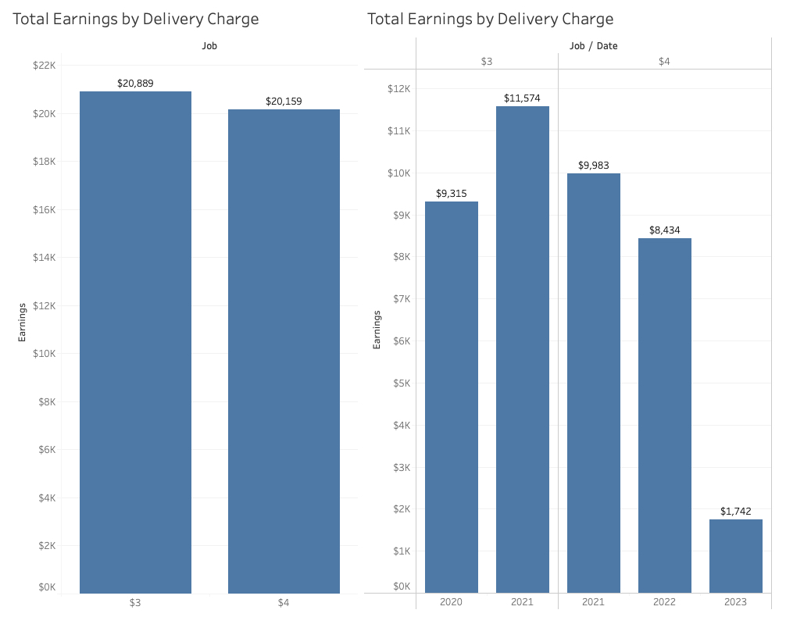
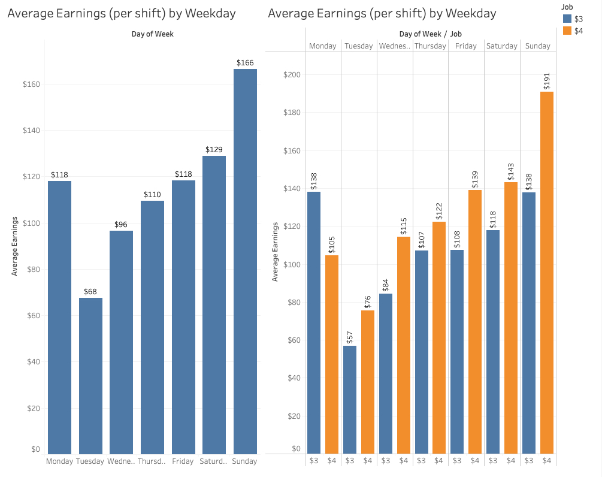
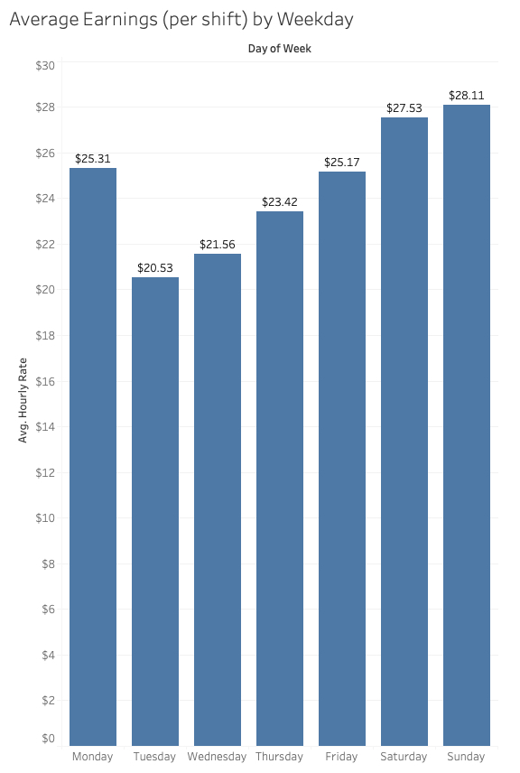
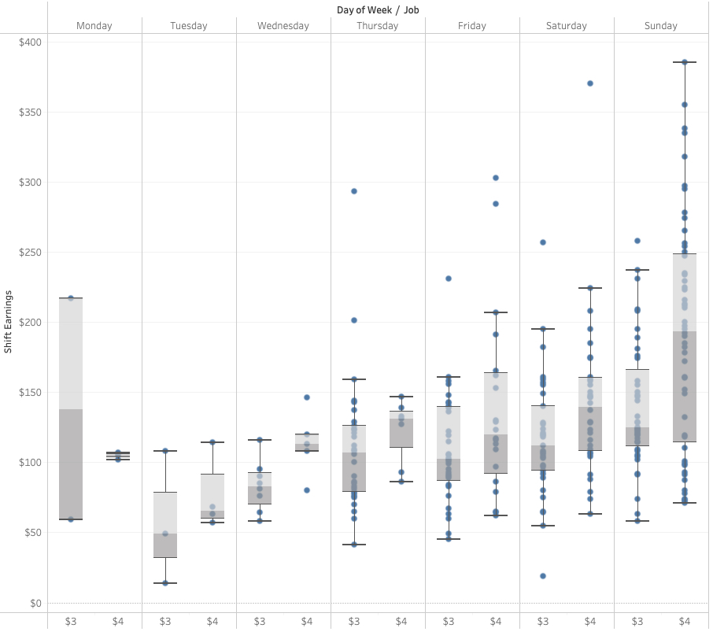
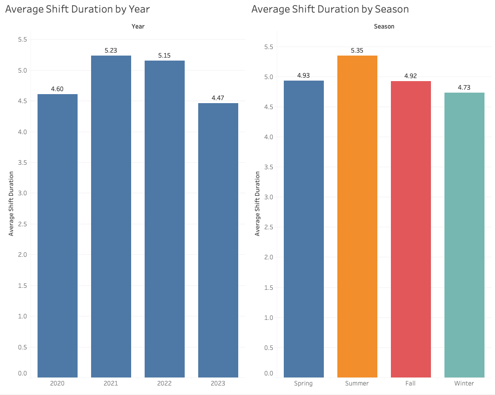
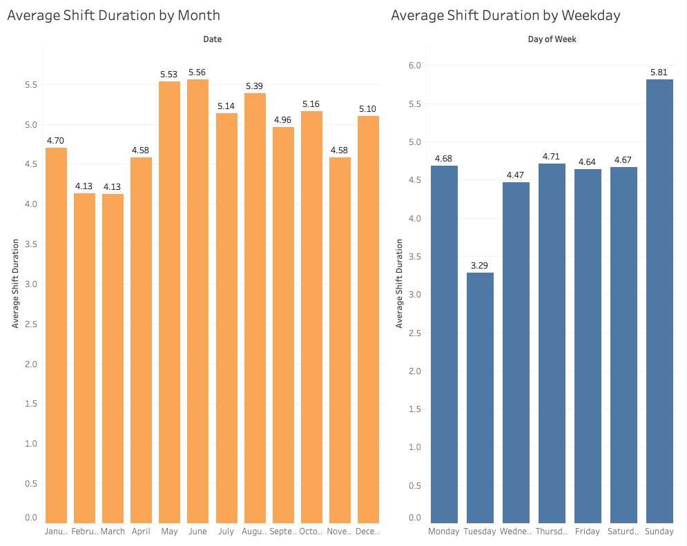
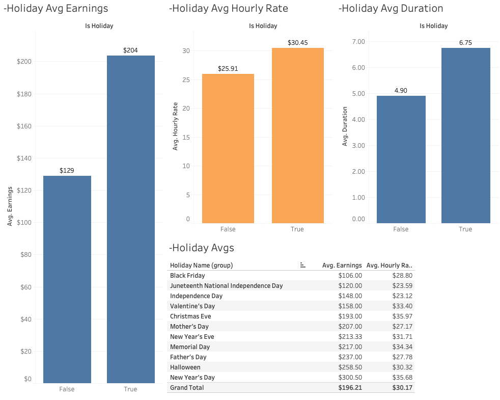
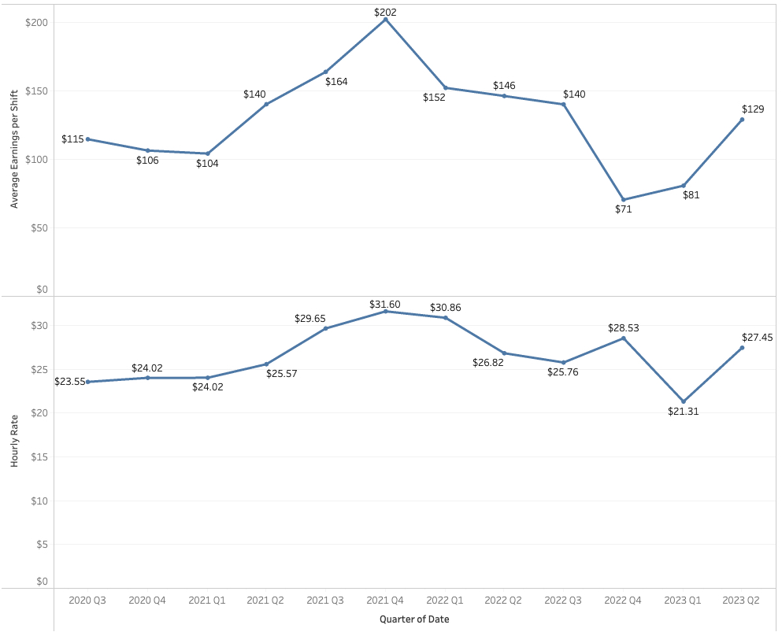

# Pizza Delivery Driver Tip Analysis

# OUTLINE/DRAFT/NOTES
TO DO : remove files I no longer need
Go over the list of files in the table and update the list
also remove the files I no longer need and remove them from the list
add note for key takeaway -> Tableau is greate for analysis and why

## Introduction & Project Motivation
The motivation for this project came from the confusions and skepticism about the anticipated tip earnings a pizza delivery driver would make during a shift. It was common and almost guaranteed to hear an inflated estimation of a driver's earnings. After some thought, I realized that there was no way of really knowing unless everything was tracked and due to the fact that this was a source of my income, I felt it to be worthwhile for me to do so. I used an app called HoursTracker where I was able to log when my shift started, when my shift ended, and the amount of money that I earned in tips during the shift. The most beneficial feature of the app was the ability to output the file as a .csv in order to be able to run an analysis when ready. Some of the initial questions and curiosities were things such as: How much does a driver make per hour? How much does a driver make per hour on a weekday vs. weekend? Has the increase in menu prices caused an increase in tips (especially since the customer could tip based on a percentage)? The data was meticulously tracked from August 3, 2020 - June 24, 2023. The delivery charge that the customer pays for a delivery was $3 until early July 2021 where it was raised to $4 thereafter. 

## Methodology & Reasoning
The main goal for this project was not only to run the analysis and gain the proper insights, but to also gain as much experience as possible with the various tools available for data analysis. The hope was to tackle the same analysis in multiple ways using matplotlib, seaborn, and Tableau, all of which are very popular and powerful within the data analysis space. Not only are these tools and frameworks used in both academic and professional environments, but they also vary in their complexity and the challenges that they introduce for a user. They all have their nuances and are desirable for different areas of work and research. A major disclaimer is that some of the visualizations created do not actually drive a lot of insight. There were moments where a specific visualization would not have a lot of impact or provide much meaning, but I still found it worthwhile to create them anyway just for the sole purpose of learning to create different kinds of visualizations with different sets of tools.

## Data

| Column         | Description                                                            | Data Type       |
|----------------|------------------------------------------------------------------------|-----------------|
| Job            | Specifies whether the job was a part of $3/$4 delivery charge time frame | Plain Text      |
| Clocked In     | Time driver punched in for the shift                                   | Time Object     |
| Clocked Out    | Time the driver punched out for a shift                                | Time Object     |
| Duration       | Duration of the shift (in hours)                                       | Float           |
| Earnings       | Amount of money that was earned during a shift                         | Integer         |
| Date           | Date of the shift                                                      | Date Time Object|
| Month          | Numerical month of the shift                                           | Integer         |
| Day            | Numerical day of the shift                                             | Integer         |
| Year           | Numerical year of the shift                                            | Integer         |
| Is Holiday     | True/False of whether the shift was during a holiday                   | Boolean         |
| Holiday Name   | The name of the holiday                                                | Plain Text      |
| Day of Week    | The day of the week for the shift                                      | Plain Text      |
| Hourly Rate    | Calculated hourly rate for the shift                                   | Float           |
| Season         | Season when the shift occurred                                         | Plain Text      |
 

## Notebooks & Files
| File                | Description                                         |
|---------------------|-----------------------------------------------------|
| cheatsheet.md       | References to things causing repeated web searching |
| cleanFunc.py        | Functions used during the data cleaning stage       |
| lessons.md          | Lessons learned while doing the project             |
| pizzaCleaning.ipynb | Jupyter Notebook used for cleaning the data         |
| pizzaEDA.ipynb      | EDA using matplotlib #1                             |
| pizzaEDA2.ipynb     | EDA using matplotlib #2                             |
| README.md           | README file for the project                         |
| Reference.ipynb     | References & examples of code found in documentation|
 

## Insights
There were questions that influenced the desire to start tracking the data as well
as questions that arose over time. Here is a list of a few questions that originally
influced this project:

- How much a delivery driver earning per shift on average?
- What was the average earning potential for the different days of the week? Which days were the most lucrative? What was the hourly rate average?
- How did the increase in the delivery charge and menu prices affect earnings and averages?
- Approximately how long was a driver working on a given day of the week?
- Where holidays worth working and how did the average earnings compare to non-holidays?
- How did the earning potential change throughtout the course of the pandemic and afterwards?
- Was the job as lucritive as some delivery drivers felt?

Please note, a much further analysis exists in the Tableau workbook with more extensive charts and graphs. This is small highlight of some highler level insights.

At a very high level, we can see the distribution of earning between the two time period ($3 delivery charge time period vs $4 delivery charge time period). When broken down by year, 2021 was the year with the highest earnings. This makes sense being as the height of the pandemic was during 2021 and a lot of shifts were worked during. 

When looking at weekday averages, Sunday is by far the most lucritave day to work. This was true during both the $3 and $4 delivery charge time periods. This helps to show that yes, the increase in the delivery charge did help increase earnings per shift by a significant amount. Clearly, and as expected, weekends (Friday/Saturday/Sunday) are the most lucritive.

The effects of the increase in the delivery charge is displayed conveniently in the boxplots. In these, we can see The median line has a visible shift in the different weekdays and there is a very visible shift in the 75th percentile. This is seen very strongly in the Sunday shifts. 

Shift duration was of interest to see where most of my time was being spent. Due to the pandemic being so lucritive, it makes sense that average shift duration is longer during 2021/2022. It was slightly shocking to see that Summer had the longest average shift duration. Due to how lucritive the holidays can be during the winter, I felt as though I worked more and longer during the Winter months. Thursdays & Sundays having the longest average duration made a lot of sense. On Sunday, I worked the lunch and dinner shift and on Thursday, I was a closing driver.

Something that I was wondering during the course of the time spent as a pizza driver was how lucritive holiday were. It was evident that tips were better on a holiday (most of the time), but it was hard to guage by how much exactly. Overall average earnings per shift are significantly higher but that is largely due to a longer average shift duration on a holiday (True) vs when it isn't a holiday (False). Due to some big tippers, the holidays felt more lucritive than ~$30/hr. This raises the question of whether or not they are worth working. With only a $5 increase per hour, it's debatably not that worth and time is better spent with family. 

When looking at the quarterly earnings over the timeframe of this dataset, the effect that the pandemic had on earnings can be better understood. There is a drastic increase in average earnings per shift during one of the peak moments of the global crisis. From 2023 (quarter 3 & 4) and early 2022 (quarter 1 & 2), quarterly tip averages were the highest of any other time period in this dataset. Especially when it is combined with the menu price increase, it helps to push those numbers up a little more.

Was the job as lucritive as people thought? Although the job is a lucritive delivery driver job, it does seem to be slightly less enticing as what people made it out to be. From what I remember, the interpretation one had of their earnings was slightly inflated due to their memeory retaining the successful nights they had and conveniently discarding the shifts that were mediocre or below par. Nonetheless, the job is still worth it so long as your car is fuel efficient. Otherwise, it debatable.